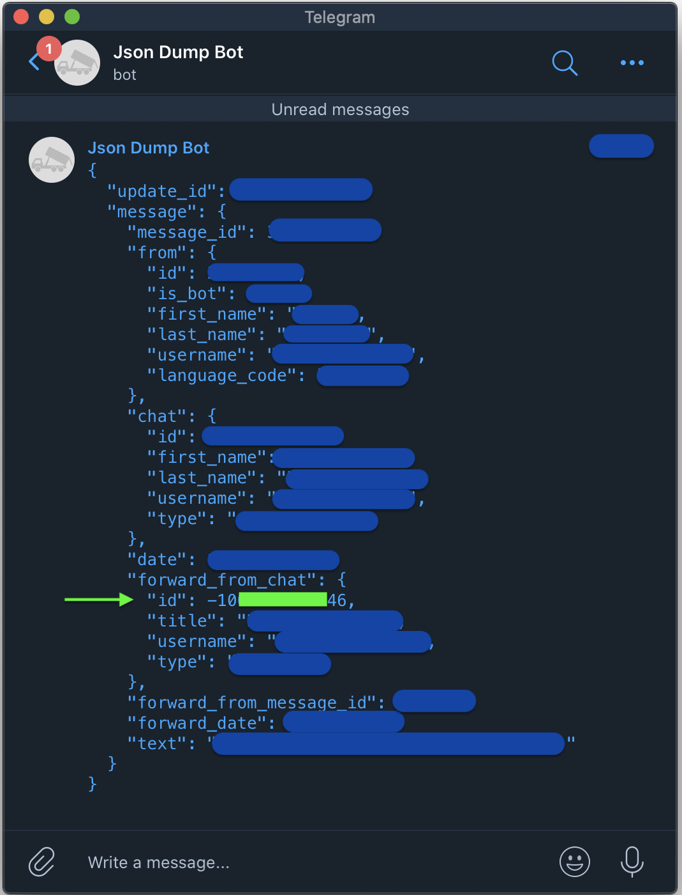
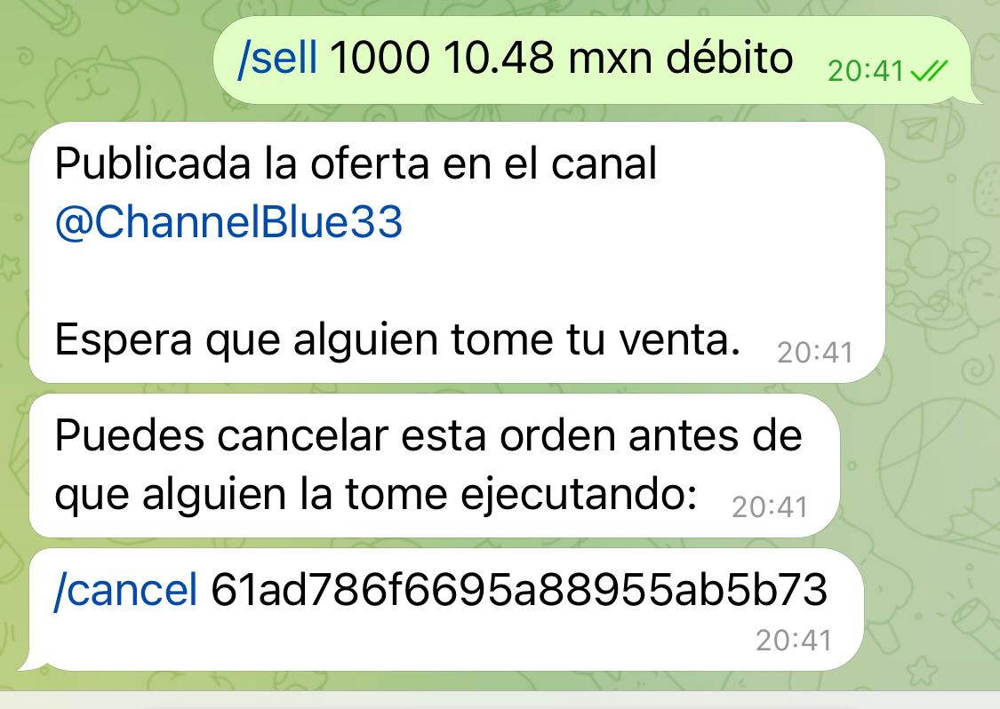
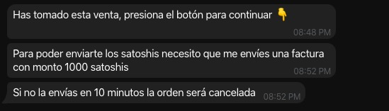
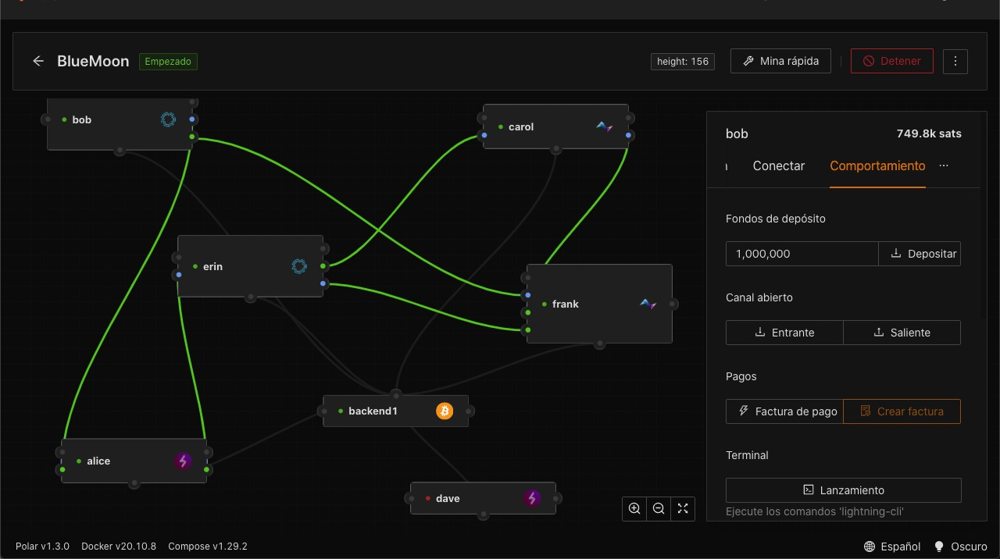
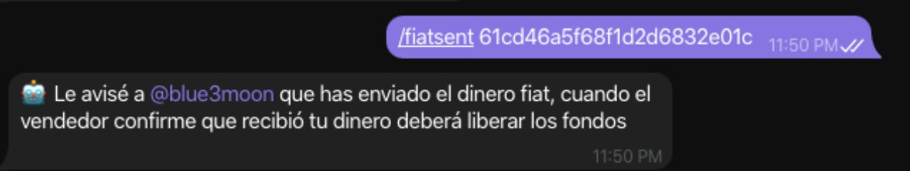
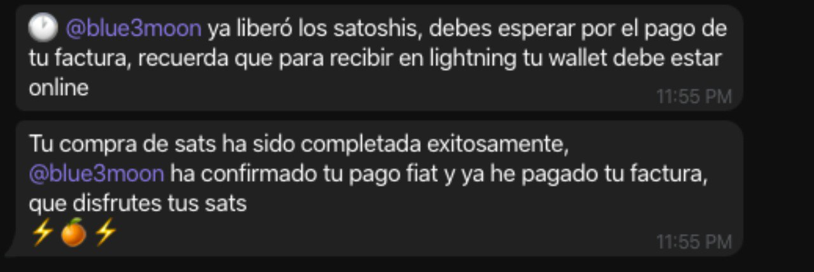

# Installation

## The following document is intended to provide the necessary information to prepare the work environment for the development of the bot by providing the technical and physical characteristics of each element.

1. Purpose.
2. Target
3. Scope.
4. Technical requirements.
5. Prepare the work environment. 
* Docker.
* MongoDB.
* P2plnbot.
* Connect to a Lightning node.


## Purpose.

Allow people to trade using the _Lightning_ network with other people on Telegram. The _p2plnbot_ bot is developed in nodejs and connects to a LND (Lightning Network Daemon) node is a full i
mplementation of a Lightning Network node. 

## Target.

Achieving that the telegram bot is able to receive payments _Lightning_ without being custodian, that is; that the user will not need permission to use the service, or provide personal data 
that may compromise their privacy thereby achieving retain full custody of their goods at all times, for this the bot will use withheld invoices and only settle such invoices from the seller
 when each party agrees to it and just after that time the bot will pay the buyer's invoice. 

## Scope of the system.

Reach all users who require to acquire Bitcoin satoshis without custody through a bot on Telegram.

## Technical requirements. 

1) Computer with internet access. 
2) Node Management System [Polar.](https://lightningpolar.com/)


3) [Docker](https://www.docker.com/): deployment automation of applications as portable, self-contained containers that can be run in the cloud or locally.
4) [MogoDB](https://www.mongodb.com/) as a database manager.

## Prepare the environment.

1) Check if you have Nodejs installed.

```
$ node -v
```

In case you do not have it installed:

* On Mac run the following instruction:
```
$ brew install node
```

* On Windows go to the following [link](https://nodejs.org/en/download/)
* On Linux:

```
$ sudo apt install npm
```

## Docker

2) Create a directory where you will place the `docker-compose.yml` file for MongoDB with the following values:

```
mkdir mongodb
cd mongodb
mkdir db-data
vi docker-compose.yml
```

The file must contain the following:

```
version: "3.7"

services:
  mongodb:
    image: mongo:5.0
    environment:
      MONGO_INITDB_ROOT_USERNAME: mongoadmin
      MONGO_INITDB_ROOT_PASSWORD: secret
    volumes:
      - ./db-data/:/data/db
    ports:
      - 27017:27017
```

3) Check if Docker is up with the following instruction:

```
$ docker ps –a
```

_Note: When executing the first command you will see the image you have created._

* Lift the container.

```
$ docker-compose up –d
```

* To enter the container, you must execute the following instructions: 

```
$ docker ps –a
```

* This command will show you the ID that has been created to later enter the container:

```
$ docker exec -it <container id> /bin/bash
```

_Note: Entering the container will allow you to enter the DB._

## MongoDB

4) Login to MongoDB

```
$ mongo admin -u mongoadmin –p secret
$ show dbs
$ use nueva_db ej.
```

## P2plnbot

5) Clone the [repository](https://github.com/grunch/p2plnbot.git) of the bot:

```
$ git clone https://github.com/grunch/p2plnbot.git
$ cd p2plnbot
$ npm install
```
6) Create a `.env` file, in the root directory of the project, there is a sample file, so you only need to copy it and fill in some data:

* Execute the following instructions:

```
$ cp .env-sample .env
$ vi .env
```

## Connect to the Lightning node. 

• To connect to an `lnd` node, we need to set some variables:

**LND_CERT_BASE64:** TLS certificate of the LND node in base64 format, you can get it in base64 format. `~/.lnd/tls.cert | tr -d '\n'` in the lnd node.

**LND_MACAROON_BASE64:** Macaron file in base64 format, the macaron file contains permission to perform actions on the lnd node, you can get it with base64 `~/.lnd/data/chain/bitcoin/mainnet
/admin.macaroon | tr -d '\n',`

* If you are using Polar you get the data as shown in the following image:


**LND_GRPC_HOST:** IP address or the domain name from the LND node and the port separated by a colon, e.g: `192.168.0.2:10009.`

**BOT_TOKEN:** u will need to log in to Telegram and search for `BotFather.` Execute the menu and select `Create a new bot` where you will choose the name of the bot and the user, once gener
ated it will show a token number that will be placed in this field. 

**CHANNEL:** Create a channel in Telegram, to do this press the write new message button. On Android it is in the lower right corner with a round icon with a pencil, and on iOS it is in the 
upper right corner with a rather small icon in the shape of a pencil. Tap on the `New channel` option.

**ADMIN_CHANNEL:** This data will be the ID of your channel, to get it write a message in your channel, forward it to the bot `@JsonDumpBot` and it will show you a JSON with the channel ID. 



* More information [aquí.](https://gist.github.com/mraaroncruz/e76d19f7d61d59419002db54030ebe35)

* File `.env`

```
LND_CERT_BASE64=
LND_GRPC_HOST='127.0.0.1:10001'
BOT_TOKEN='1862047833:AAEFx4SSm1sDdiw9vvHzChdtKpC4WuVFRjw'
FEE=.001
DB_USER='mongoadmin'
DB_PASS='secret'
DB_HOST='localhost'
DB_PORT='27017'
DB_NAME='p2plnbot'

INVOICE_EXPIRATION_WINDOW=60000
HOLD_INVOICE_EXPIRATION_WINDOW=60
CHANNEL='@testeandomascosas'
ADMIN_CHANNEL='-1001323811481'

MAX_DISPUTES=8
ORDER_EXPIRATION_WINDOW=7200

PENDING_PAYMENT_WINDOW=5

FIAT_RATE_EP='https://api.yadio.io/rate'
```
• Once the file has been edited, execute the following instruction:

```
$ npm start
```

• For testing purposes:

```
$ npm test
```

## Start with the bot.

• It will be necessary to have already created a bot with `BotFather`, to have another number to use with Telegram and to have opened channels in Polar.

1) Enter the bot and type the following:

```
/start 
```

It will display a menu, we will choose the `/sell` option to sell with the necessary requirements.




2) You must start the bot with the same account with the command:

```
/start
```

3) In the channel you will see the offer, you must choose to buy with the other Telegram user.


4) Take the order in the channel. Click on Buy Satoshis.


5) Enter the bot and click continue.


This is the message that will be displayed.



6) Create invoice in Polar with some of the users and paste in Telegram. Choose `Create Invoice` in the behavior part.



7) Set the sales quantity.


8) Choose `Copy and Close.`


9) Enter the `bot` and paste the invoice. 


A request for payment will be sent to the seller and will be displayed in the `bot.`.


10) Paste the invoice in Polar and pay it. 


11) When someone takes the order, the `bot` will display the following message:


12) The following will be displayed in the `bot` for the other user:


13) The user must release the funds with the command `/fiatsent`, to do this he must copy and paste with the `id`



14) The `bot` will indicate that the user has already sent the fiat money.


15) The user must release the funds with the `/release` command by copying and pasting with the `id`.


17) Finally, the buyer will be notified that the transaction has been successfully completed.


